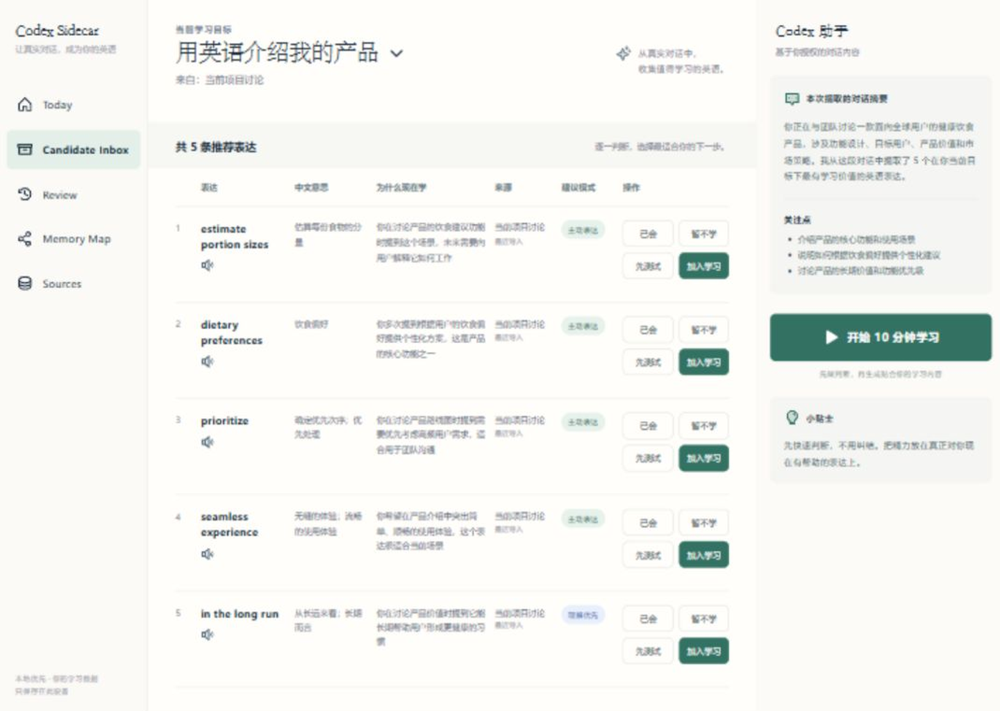

# Contextual Vocab Coach

> 扫描你真实做过的事，整理成一份属于你的英语词表，再把少量表达送进练习和复习。

`contextual-vocab-coach` 是一个面向 Codex Desktop 的本地英语学习 Skill。它不会要求你先想一个抽象的学习目标，也不会把每段对话割裂成一张小词表。首次运行时，它会在本机读取可用的 Codex 任务，提取用户自己写过的消息，将工作、研究、产品、生活等内容整理成一份统一的个人英语词表。

上下文默认隐藏，只用于排序、分类和来源追溯。用户打开后首先看到的是完整词表，而不是被迫选择“我要学哪个项目”。

## 新用户从这里开始

完成安装后，在 Codex 中说：

```text
$contextual-vocab-coach 打开我的词汇学习工作台
```

第一次打开时会发生这些事情：

1. 扫描本机现有的活跃和已归档 Codex 任务。
2. 只把用户自己写的消息作为学习需求证据；不把助手和工具输出当作用户能力。
3. 合并 540 个基础生活表达、历史中直接出现的英语，以及根据真实任务整理出的领域表达。
4. 去重后生成一份静态个人词表，并保留“词汇—主题—任务来源”的关联。
5. 打开本地工作台。用户可以直接搜索词表、加入学习、练习和复习。

首次扫描量取决于你的 Codex 历史，任务较多时可能需要几分钟。终端会显示处理进度；工作台就绪后会显示扫描到的任务数、读取的数据量和词表规模。

后续不需要反复全量重建。在“我的词表”中点击 **更新词表**，系统会优先处理最新任务，只重读新增或发生变化的内容，并保留已经会了、近期不用、正在学习和复习历史。

## 这个产品到底做什么

```text
本机 Codex 任务
      ↓
用户自己写过的消息
      ↓
统一的个人词表（基础英语 + 历史命中 + 领域表达）
      ↓
用户主动选择少量内容
      ↓
主动回忆 → 反馈 → 间隔复习 → 换场景迁移
```

- **完整词表可以很大**：保留所有有根据、去重后的表达，不按每个主题限制为 5–8 个。
- **学习队列必须很小**：只有用户明确加入或选择短测的内容才进入练习，避免一次背几百个词。
- **不需要先定目标**：默认方向就是“把我日常正在做的事，用英语表达出来”。只有用户主动提出时才建立更窄的目标。
- **上下文不是首页导航**：主题和来源是隐藏元数据，需要筛选或溯源时再看。
- **认识和会用不是一回事**：阅读识别、主动表达和听音理解分别记录。

## 工作台里有什么

- **今日学习**：优先处理到期复习，再加入少量新表达。
- **我的词表**：搜索完整个人词表，按来源、上下文和难度做可选筛选，一键增量更新。
- **复习**：用主动回忆记录真实表现，而不是“看过答案就算会”。
- **词汇地图**：把真实任务连接到主题节点和重点表达节点，用颜色和文字显示学习状态。
- **来源与扫描**：核对扫描覆盖量、主题分类和任务索引，并暂停不想继续参与推荐的来源。



## 安装

### 需要什么

- Codex Desktop
- Python 3.10 或更高版本
- Git

仓库已经包含可直接运行的前端构建产物。普通使用不需要 Node.js；只有修改前端源码时才需要 Node.js 22。

### Windows PowerShell

```powershell
git clone https://github.com/SmallHorseBrother/contextual-vocab-coach.git
$source = Resolve-Path .\contextual-vocab-coach\contextual-vocab-coach
$target = Join-Path $env:USERPROFILE ".codex\skills\contextual-vocab-coach"
New-Item -ItemType Directory -Force -Path $target | Out-Null
Copy-Item -Recurse -Force "$source\*" $target
```

### macOS / Linux

```bash
git clone https://github.com/SmallHorseBrother/contextual-vocab-coach.git
mkdir -p ~/.codex/skills/contextual-vocab-coach
cp -R contextual-vocab-coach/contextual-vocab-coach/. ~/.codex/skills/contextual-vocab-coach/
```

复制完成后，重启或刷新 Codex。然后使用开头的命令打开工作台。

## 直接从终端启动工作台

如果你已经位于克隆后的仓库根目录：

```powershell
python .\contextual-vocab-coach\scripts\workbench_server.py
```

浏览器打开 `http://127.0.0.1:4174/`。服务只监听本机回环地址。

macOS / Linux 可将 `python` 换成 `python3`：

```bash
python3 ./contextual-vocab-coach/scripts/workbench_server.py
```

常用启动选项：

```text
--demo                 只看演示数据，不读取真实学习档案
--no-context-scan      本次启动不自动扫描 Codex 历史
--port 4175            4174 被占用时改用其他端口
--codex-home PATH      Codex 数据不在默认位置时手动指定
--store PATH           使用另一份本地学习档案
```

## 日常怎么用

你也可以不打开界面，直接在 Codex 对话中使用：

```text
$contextual-vocab-coach 更新我的个人词表。
$contextual-vocab-coach 开始今天到期的复习。
$contextual-vocab-coach 测试我是否真的会用这些表达。
$contextual-vocab-coach 找出与具身智能比赛相关的表达。
$contextual-vocab-coach 暂停使用某个来源。
```

推荐的学习闭环：

1. 在完整词表中搜索或浏览。
2. 将真正想学的表达标记为“加入学习”或“等待短测”。
3. 一次练习 3–5 个表达。
4. 先回忆、再看参考答案，然后按真实情况选择“再来一次 / 困难 / 掌握 / 轻松”。
5. 后续复习会改变措辞或场景，检查能否迁移使用。

## 扫描范围和隐私

默认行为是明确而激进的：启动真实工作台时，扫描本机可用的全部活跃和已归档 Codex 任务。扫描只在本机完成。

- 读取任务标题、时间和用户自己写过的消息。
- 不把助手回复或工具输出当作用户学习需求。
- 学习档案只保存词汇、分类、来源关联、计数、时间戳和内容指纹等派生结果。
- 不把原始聊天正文复制进学习档案。
- 工作台只监听 `127.0.0.1`，不会自动向公网提供服务。
- 不想自动扫描时，使用 `--no-context-scan`。
- 可以暂停来源；只有明确执行 purge 时才会删除仅由该来源支持的学习记录。

默认状态文件：

- Windows：`%LOCALAPPDATA%\contextual-vocab-coach\state.json`
- macOS / Linux：`$XDG_DATA_HOME/contextual-vocab-coach/state.json`
- 未设置 `XDG_DATA_HOME`：`~/.local/share/contextual-vocab-coach/state.json`

可用 `CONTEXTUAL_VOCAB_HOME` 或 `--store` 指定其他位置。

## 常见问题

### 为什么词表很多，但今天只学几个？

“词表库存”和“学习队列”是两层。系统可以保存数百或数千个有用表达，但一次只安排少量主动回忆。看到某个词不会自动把它加入复习。

### 为什么不让我先选择上下文？

因为用户的工作和生活通常横跨多个主题。产品先给出一份统一词表；上下文只用于搜索、推荐、地图和来源追溯。需要时仍可按“产品构建”“具身智能”等主题筛选。

### 为什么是 `deployment pipeline`，不是 `deploy pipeline`？

因为这里表达的是一个名词概念“部署流水线”。英语复合名词通常用名词 `deployment` 修饰 `pipeline`，所以 **deployment pipeline** 是自然且常见的搭配，**CI/CD pipeline** 也很常用。`deploy` 通常是动词；`deploy pipeline` 更容易被理解成“部署这条流水线”这一动词结构，而不是流水线的名称。

### 工作台显示的是演示数据怎么办？

确认没有使用 `--demo`，并从真实 Skill 或仓库脚本启动。演示模式会在页面顶部明确标注，不代表已经扫描你的 Codex 历史。

### 4174 端口被占用怎么办？

```powershell
python .\contextual-vocab-coach\scripts\workbench_server.py --port 4175
```

然后打开 `http://127.0.0.1:4175/`。

### 扫描不到任务怎么办？

确认 Codex 数据位于默认的 `~/.codex`。如果不是，使用：

```powershell
python .\contextual-vocab-coach\scripts\workbench_server.py --codex-home "你的 Codex 数据目录"
```

## 项目结构

```text
contextual-vocab-coach/
├── SKILL.md                       # Skill 入口和真实工作流
├── agents/openai.yaml             # Codex 展示与调用元数据
├── data/starter-lexicon.json      # 540 项基础生活英语
├── scripts/codex_context.py       # Codex 全量与增量扫描
├── scripts/vocab_store.py         # 学习状态、来源和复习调度
├── scripts/workbench_server.py    # 本地工作台与 JSON API
├── workbench/                     # React 源码和构建产物
├── references/                    # 扫描、隐私、练习和存储规则
└── examples/                      # 不含真实个人信息的演示材料
```

## 开发与验证

```powershell
python -m py_compile .\contextual-vocab-coach\scripts\vocab_store.py
python -m py_compile .\contextual-vocab-coach\scripts\codex_context.py
python -m py_compile .\contextual-vocab-coach\scripts\workbench_server.py
python -m unittest discover -s tests -v
Set-Location .\contextual-vocab-coach\workbench
npm ci
npm run build
npm run test:sites
```

CI 会在 Python 3.10、Python 3.12 和 Node.js 22 上验证后端、前端构建和 Sites 兼容性。

## 当前边界

当前版本专注于单人、本地优先的学习闭环，暂不包含多设备同步、教师后台、排行榜、社交系统和自动音视频生成。复习调度采用保守基线；项目的核心创新是从真实个人上下文建立词表，并把表达重新放回用户熟悉的任务中练习。

项目采用 [MIT License](LICENSE)。
