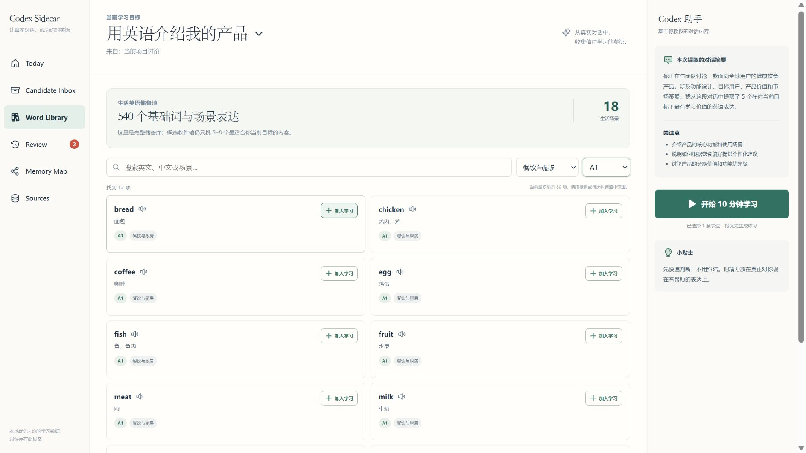

# Contextual Vocab Coach

> 你忙什么，就优先学什么英语；用你熟悉的事，记住你用得上的表达。

`contextual-vocab-coach` 是一个面向 Codex 的开源英语词汇学习 Skill。它内置 **540 个基础词、短语和生活场景表达**，覆盖 18 类日常场景；同时从你**明确授权的当前目标和上下文**中发现近期最值得学的内容，再用熟悉场景帮助理解，通过主动回忆和间隔复习检查是否真正掌握。

它主要解决三个问题：

| 问题 | 做法 |
|---|---|
| 学什么？ | 根据近期真实任务生成小批候选，并解释为什么现在值得学 |
| 怎么学？ | 将薄弱表达连接到熟悉场景、已有词汇和真实用途 |
| 什么时候复习？ | 分别记录阅读识别与主动表达，用成熟的调度基线安排复习 |

其中“学什么”和“怎么学”是项目的核心差异；复习调度不是自研算法卖点。

大词库与小批学习是两层：540 项是可搜索的储备池，候选收件箱每次仍只推荐 5–8 项。只有用户明确点击“加入学习”或确认上下文候选后，内容才进入复习队列，避免把几百个词一次性变成压力。词库中的 A1/A2/B1 是便于筛选的实用难度提示，不是官方考试评级。

## 它和普通 AI 词表有什么不同

- 聊天上下文只证明内容可能相关，不证明用户不会；候选内容仍需确认或短测。
- 学习目标是一件即将用英语完成的事，而不是永久职业标签。
- 同时关注词、短语、搭配和表达框架，不只堆专业名词。
- 个人情景用于建立记忆，后续用变化后的场景检验迁移。
- `known`、`not_now`、学习轨迹和复习历史会持续保留，新上下文不会把它们覆盖。
- 阅读认识、主动表达和听音理解是独立掌握轨道。
- 默认只保存最小必要摘要和结构化学习记录，不保存原始聊天内容。

## 安装

需要 Python 3.10 或更高版本，无第三方 Python 依赖。仓库已包含可直接运行的可视化工作台构建产物；只有修改前端源码时才需要 Node.js。

```powershell
git clone https://github.com/SmallHorseBrother/contextual-vocab-coach.git
Copy-Item -Recurse .\contextual-vocab-coach\contextual-vocab-coach "$env:USERPROFILE\.codex\skills\contextual-vocab-coach"
```

重启或刷新 Codex 后，可以显式调用：

```text
$contextual-vocab-coach 根据当前这段项目讨论，帮我找出为了用英语介绍产品最值得学的表达。
```

也可以这样继续：

```text
$contextual-vocab-coach 开始今天到期的复习。
$contextual-vocab-coach 显示我当前任务的词汇掌握情况。
$contextual-vocab-coach 暂停使用“产品讨论”这个来源。
$contextual-vocab-coach 打开我的词汇学习工作台。
```

## 可视化工作台

Skill 现在同时提供 Codex 对话和本地可视化工作台。Codex 负责理解你授权的上下文、筛选表达与生成个性化练习；工作台适合搜索完整词库、按场景和难度筛选、把选中的词加入学习、快速处理上下文候选、开始 10 分钟学习、记录复习反馈、查看掌握地图以及控制来源。




直接启动真实本地学习档案：

```powershell
python .\contextual-vocab-coach\scripts\workbench_server.py
```

然后在浏览器打开 `http://127.0.0.1:4174/`。服务只监听本机回环地址，所有操作继续写入同一个本地 JSON 学习档案。

如果只是体验界面，可启动不会触碰真实档案的临时演示：

```powershell
python .\contextual-vocab-coach\scripts\workbench_server.py --demo
```

## 一次完整体验

1. 你说出一个具体目标，例如“我想不依赖逐句翻译读懂机器人论文”。
2. 你指定可以使用的当前对话、粘贴内容或文件。
3. Skill 生成一张可修改的学习背景卡。
4. Skill 给出 5–8 个候选表达，并注明推荐原因、来源与目标能力。
5. 你把它们标记为“已会”“近期不用”“先测试”或“加入学习”。
6. Skill 用熟悉场景解释 3–5 个薄弱项，然后撤掉答案要求主动回忆。
7. 结果写入本地学习记录；下次先复习到期项目，再添加少量新内容。
8. 复习会更换措辞或场景，避免只记住原故事。

如果你暂时没有可导入的上下文，也可以先打开 **Word Library**，从家庭、饮食、购物、交通、旅行、工作、学习、健康、情绪、数码等 18 个场景中搜索基础内容。完整词库不等于自动学习清单；每个词仍由你主动加入。

仓库里的虚构产品示例可以用于验证本地工具：

```powershell
$demo = Join-Path $env:TEMP "contextual-vocab-demo"
python .\contextual-vocab-coach\scripts\vocab_store.py --store $demo init
python .\contextual-vocab-coach\scripts\vocab_store.py --store $demo apply-pack --input .\contextual-vocab-coach\examples\sample-pack.json --dry-run
python .\contextual-vocab-coach\scripts\vocab_store.py --store $demo apply-pack --input .\contextual-vocab-coach\examples\sample-pack.json
python .\contextual-vocab-coach\scripts\vocab_store.py --store $demo lexicon-search --query water
python .\contextual-vocab-coach\scripts\vocab_store.py --store $demo status --format markdown
```

## 本地数据

默认状态文件位于：

- Windows：`%LOCALAPPDATA%\contextual-vocab-coach\state.json`
- macOS/Linux：`$XDG_DATA_HOME/contextual-vocab-coach/state.json`，未设置时使用 `~/.local/share/contextual-vocab-coach/state.json`

可用 `CONTEXTUAL_VOCAB_HOME` 或 `--store` 指定其他位置。项目目录中的本地状态文件已加入 `.gitignore`。

Skill 提供三类来源控制：

- `active` / `paused`：决定该来源能否继续产生候选。
- 删除 metadata：删除来源摘要和推断锚点，但保留用户明确加入的学习项与复习进度。
- purge：连同仅由该来源支持的学习项和复习事件一起删除。

`purge` 是破坏性操作，Skill 只应在用户明确要求时执行。

## 项目结构

```text
contextual-vocab-coach/
├── SKILL.md                  # Skill 入口和核心工作流
├── agents/openai.yaml        # Codex 展示与调用元数据
├── data/starter-lexicon.json # 540 项、18 场景的内置起步词库
├── scripts/build_starter_lexicon.py # 可复现生成内置词库
├── scripts/vocab_store.py    # 本地状态、来源、复习和隐私操作
├── scripts/workbench_server.py # 本地工作台与 JSON API
├── workbench/                # React 源码和可直接运行的构建产物
├── references/               # 按任务加载的详细规则
└── examples/                 # 不含真实个人信息的演示材料
```

根目录的 `tests/` 覆盖词库规模与筛选、显式加入学习、重复导入、独立掌握轨道、来源删除和历史保留等关键不变量。

## 当前边界

当前版本专注于单人、本地优先、可验证的学习闭环，不包含：

- 静默扫描全部聊天历史或整台电脑
- 多平台后台同步
- 教师后台、排行榜或社交系统
- 自动图片、音频和视频生成
- “英语大脑”或真实认知结构诊断
- Token 商城或 API Key 转售

Codex 当前对话本身就是第一个上下文入口。未来若增加 Hook 或本地助手，也必须继续遵守明确授权、增量处理、失败不干扰工作和不覆盖学习记录的原则。

## 开发与验证

```powershell
python -m py_compile .\contextual-vocab-coach\scripts\vocab_store.py
python -m py_compile .\contextual-vocab-coach\scripts\workbench_server.py
python .\contextual-vocab-coach\scripts\build_starter_lexicon.py
python -m unittest discover -s tests -v
Set-Location .\contextual-vocab-coach\workbench
npm ci
npm run build
npm run test:sites
```

项目采用 [MIT License](LICENSE)。
